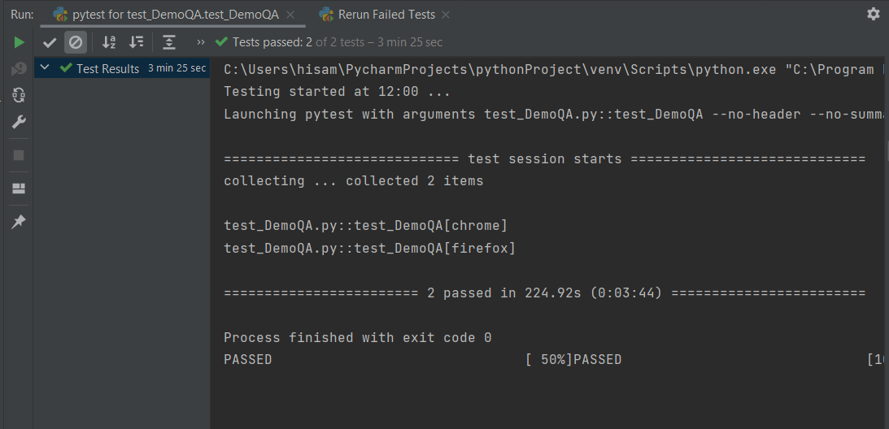

Тестовое задание от "Ритм"

---
Описание выполнной работы: 

Структура проекта реализована с применением паттерна PageObject, который помогает разделить логику тестов от реализации.

**Base Page** — Реализует в себе необходимые методы для работы с webdriver.

**DemoQA** — Реализует методы для работы с элементами на конкретной веб-странице

**Сами тесты:**

**Фикстуры:**

В pytest есть зарезервированное имя для файла с фикстурами — conftest.py. Содержит инициализацию для WebDriver. Фикстуры в pytest — функции которые имеют свою периодичность выполнения.
Это альтернативная замена SetUp и TearDown методов в unittest.

----
Результат после прогона теста:

